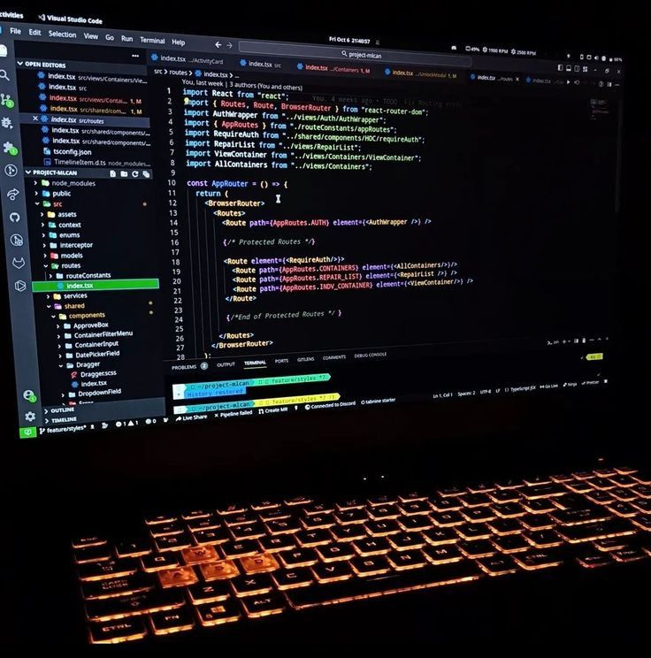

### "The future depends on what you do today"
# Software-Engineering 👩🏾‍💻💻

### Este repositório foi criado para informações sobre conceitos importantes, aprendidos durante a graduação.

 

  
 Recomendação de leitura 📖 

  - 'Entendendo Algoritmos' por  Aditya Y. Bhargava
  - 

 
 

  <table>
    <tr>
      <td></td>
      <td></td>
    </tr>
  </table>

## 📚☑️ Tópicos  

- ✨ [Modelagem de Sistemas](modelagem.md)
- ✨ [Engenharia de Requisitos](requisitos.md)

