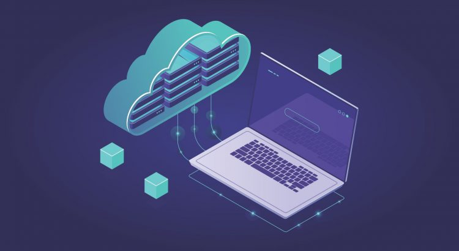

# ☁️ Cloud Computing 

Este repositório é dedicado aos meus estudos sobre **Computação em Nuvem**.  

</img>

 

# 📂 Estrutura
- 📂 Conceitos básicos de Cloud
- 📂 Principais provedores (AWS, Azure, GCP)
- 📂 Computação, armazenamento, redes e bancos de dados
- 📂 Estratégias de migração para nuvem
- 📂 Glossário, links e materiais de apoio

 

# 📚 O que é ? Definição
Cloud Computing, ou Computação em Nuvem, é a entrega de recursos computacionais (como servidores, armazenamento, bancos de dados, redes, software e mais) por meio da internet — a chamada “nuvem”.
 A ideia principal é fornecer acesso a recursos de computação sob demanda pela Internet, em vez de depender de recursos locais ou de servidores físicos.

# 🧠 Motivos para utilizar essa tecnologia
- Escalabilidade: Você pode aumentar ou reduzir os recursos conforme necessário, de forma automática ou com poucos cliques.

- Custo-benefício: Paga-se apenas pelo que usar (modelo pay-as-you-go). 

- Confiabilidade: Alta disponibilidade e recuperação de desastres embutidas.

- Acesso remoto: Pode acessar seu sistema de qualquer lugar com internet.

- Menos preocupação com infraestrutura: Foco no desenvolvimento e não em servidores físicos.

 

# 📦 Principais Modelos de Serviço

</img>

### - IaaS (Infrastructure as a Service)
Aluguel de máquinas virtuais, redes e armazenamento.
### - PaaS (Platform as a Service)
Ambiente pronto para você apenas desenvolver seus aplicativos, sem se preocupar com o servidor.
### - SaaS (Software as a Service)
Programas prontos na nuvem.

 

# ☁️ Tipos de Nuvem

</img>

- Nuvem Pública: Infraestrutura compartilhada (ex: AWS, Azure).
Exemplos: Google Drive, Gmail, Netflix.

- Nuvem Privada: Infraestrutura exclusiva de uma organização. Exemplo: Bancos que guardam informações no próprio servidor.

- Nuvem Híbrida: Combinação das duas, equilibrando segurança e escalabilidade. Exemplo: Uma empresa que guarda dados no próprio servidor mas usa a pública para acesso de clientes.

- Nuvem Comunitária: É como um coworking: várias pessoas ou empresas compartilham o mesmo espaço porque têm interesses parecidos. Exemplo: Universidades que dividem uma nuvem para pesquisas.

 

# 👉 Tecnologias que dão suporte para a nuvem

- Virtualização.
- Computação em grade - grid computing.
- Computação em Cluster.
- Armazenamento em rede.
- Automação.
- Redes de alta velocidade.
- Segurança.

 

# 🌎 Provedores de Computação em Nuvem

### São empresas que oferecem acesso à tecnologia pela internet, sem você precisar comprar e manter tudo fisicamente. 
 

</img>

Alguns dos principais:
1. AWS 
2. Microsoft Azure
3. Google Cloud Platform
4. Oracle Cloud

#### Os maiores são AWS, Microsoft Azure e Google Cloud, cada um com suas especialidades.

 

# ☁️ Migração de Aplicações para a Nuvem
 Migrar para a nuvem é pegar um sistema, site, aplicativo ou banco de dados que está rodando em computadores físicos (servidores locais) e transferi-lo para rodar em servidores de um provedor de nuvem.

### 🚚 Modelos de Migração

- Rehost (Lift and Shift):
Levar o aplicativo para a nuvem sem mudar nada no código.

- Replatform (Lift, Tinker, and Shift):
Migrar para a nuvem com pequenos ajustes para melhorar performance.

- Repurchase:
Substituir a aplicação por uma versão SaaS pronta.

- Refactor / Re-architect:
Reescrever o aplicativo para aproveitar melhor os recursos da nuvem.

- Retire:
Identificar aplicações que não são mais úteis e desligá-las, em vez de migrar.

- Retain:
Manter algumas aplicações ainda no servidor físico local (on-premises), quando a migração não faz sentido.

 

# ☁️ Serviços de Processamento de Dados na Nuvem

#### 📍 Processar dados é basicamente pegar informações brutas (dados) e transformá-las em algo organizado.

####  Sem essa ferramenta as empresas precisavam de servidores próprios e muito caros para lidar com grandes volumes de dados, e se o volume crescesse, tinham que comprar mais máquinas. Com a nuvem é possível alugar recursos de processamento sob demanda e aumentar ou diminuir a capacidade quando quiser.

### 🔑 Tipos de Serviços de Processamento de Dados na Nuvem

1. Processamento em Lote (Batch Processing)
2. Processamento em Tempo Real (Stream Processing)
3. Big Data Analytics
4. Machine Learning e Inteligência Artificial
5. TL (Extract, Transform, Load)

 

# 🌩️🔝 Serviços de Armazenamento e Análise de Dados 

### 1️⃣ Armazenamento de Dados na Nuvem
- Armazenamento de Objetos, Armazenamento de Arquivos e Armazenamento em Bloco.

### 2️⃣ Análise de Dados na Nuvem

A análise de dados na nuvem permite transformar grandes volumes de informações em relatórios, previsões e insights úteis para empresas.

- Data Warehousin; Big Data Analytics; Machine Learning e I; Ferramentas que ransformam dados em gráficos e dashboards.

 

# 🌥️ Soluções em Nuvem

Quando falamos em soluções em nuvem, estamos nos referindo a formas práticas de usar a computação em nuvem para resolver necessidades reais.
Ou seja: em vez de pensar só em tecnologia ou infraestrutura, aqui pensamos em como a nuvem ajuda na prática — seja em empresas, governos, escolas ou até no nosso dia a dia.

 

# 🏗⚙️ Arquitetura em Nuvem
### Os modelos de arquitetura em nuvem mostram como esses recursos e serviços são organizados para trabalhar da melhor forma possível. 

### 1. Arquitetura Monolítica - Tudo da aplicação está junto e conectado em um único "bloco".
- Mais simples de desenvolver no início e mais fácil para pequenos projetos.
- Se uma parte falhar, o sistema todo pode parar.

### 2. Arquitetura em Camadas - A aplicação é dividida em camadas, cada uma com uma função.
- Separa responsabilidades, facilitando manutenção e escalabilidade.

### 3. Arquitetura Baseada em Serviços (SOA) - A aplicação é dividida em serviços independentes, cada um cuidando de uma função específica.
- Se um serviço falhar, os outros continuam funcionando.
- Pode ficar mais complexo de gerenciar conforme cresce.

### 4. Arquitetura de Microsserviços - Uma evolução da SOA. Cada função é um microsserviço separado e pode ser atualizado, escalado e mantido sem mexer nos outros.
- Muito flexível e escalável.
- Permite usar linguagens diferentes em cada serviço.
- Exige mais conhecimento para gerenciar comunicação entre serviços.

### 5. Arquitetura Serverless (Sem Servidor) - Você só escreve o código e a nuvem cuida de toda a infraestrutura.
- Menos preocupação com servidores.
- Bom para tarefas pequenas e rápidas, mas não para tudo.

### 6. Arquitetura Baseada em Contêineres - Usa contêineres (como Docker) para empacotar tudo que a aplicação precisa para rodar, garantindo que funcione igual em qualquer lugar.

 

# 📌Qualidade de Serviço (QoS - Quality of Service) em Nuvem
### A Qualidade de Serviço em nuvem é como um "acordo de desempenho" entre quem fornece o serviço de nuvem  e quem usa.

## 🏗️ Principais Aspectos

- Disponibilidade, desempenho, escalabilidade, Confiabilidade, Segurança, Latência e Acordos de Nível de Serviço (SLA).

## 🛠️ Como a Qualidade é Garantida?
- Data Centers espalhados pelo mundo: Se um falhar, outro assume (redundância). ✔️

- Monitoramento 24h: Sistemas automáticos que verificam falhas.✔️

- Recursos sob demanda: Aumentam quando há mais usuários.✔️

- Backups automáticos: Evitam perda de dados.✔️

### 🌐 Exemplos Reais
- Netflix: Usa a nuvem para garantir filmes e séries disponíveis sem interrupções.

- Internet Banking: Precisa de segurança máxima e disponibilidade 24h.

- E-commerce: Em datas como Black Friday, precisam de escalabilidade para atender milhões de acessos.

 

# ✅Segurança e Privacidade

## 1️⃣🆗 Segurança em Nuvem
A segurança é tudo o que é feito para proteger os dados, sistemas e redes que estão na nuvem.
 Algumas estratégias importantes:
- Criptografia.
- Controle de acesso.
- Firewalls e antivírus:
- Monitoramento 24h:
- Backups:

## 2️⃣🆗 Privacidade em Nuvem
### A privacidade garante que seus dados pessoais não sejam usados sem sua autorização.

- LGPD (Brasil) e GDPR (Europa):
 São leis que protegem as informações pessoais. Empresas de nuvem precisam seguir regras rígidas sobre como armazenar e usar seus dados.

- Políticas de privacidade claras:
 As empresas devem explicar o que fazem com os dados e pedir seu consentimento antes de coletá-los.

- Localização dos dados:
 Às vezes, é importante saber em qual país o servidor está, pois as leis podem ser diferentes.

## 📚💭 Referências
- [AWS Training](https://aws.amazon.com/training/)
- [Microsoft Learn](https://learn.microsoft.com/azure)
- [Google Cloud Training](https://cloud.google.com/training)
