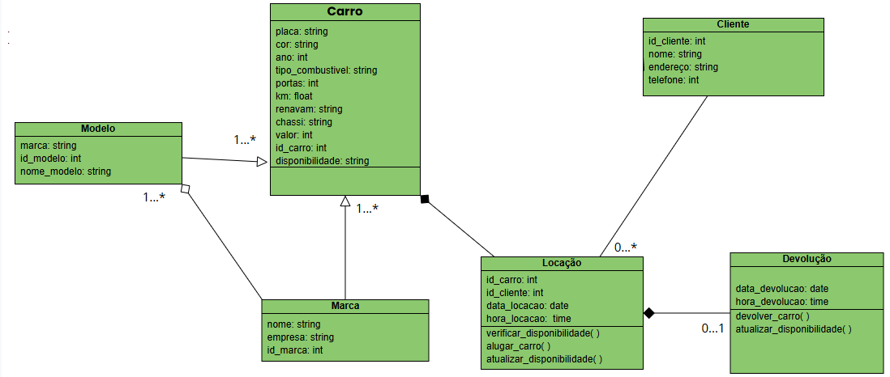
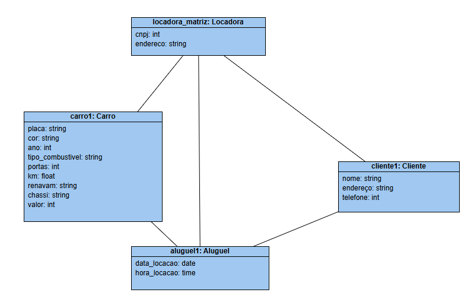
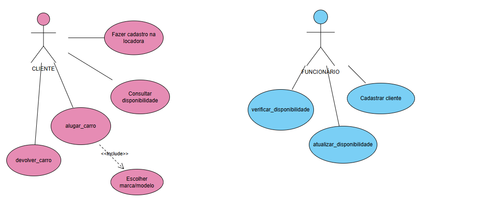
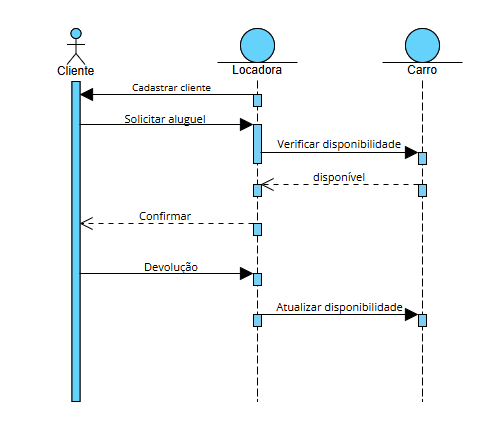
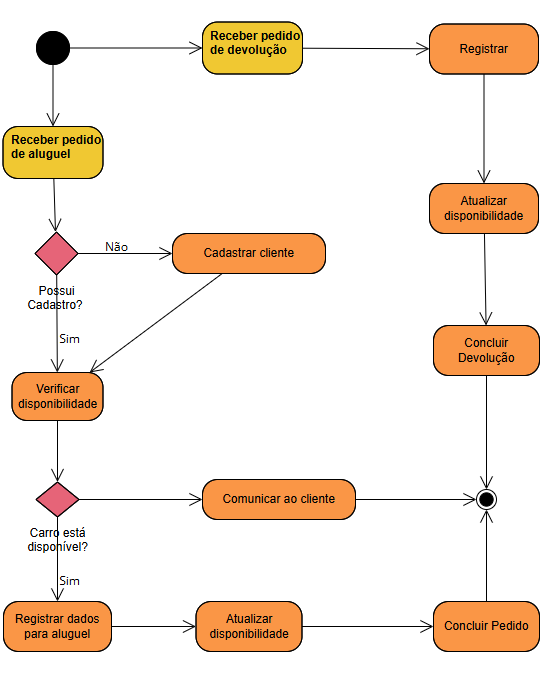

<h1> UML - Unified Modeling Language   Modelagem e design orientado a objetos. </h1>

#### A UML é uma combinação de várias notações orientadas a objetos: design orientado a objetos, técnica de modelagem de objetos e engenharia de software orientada a objetos.

<h2> 📌 Importância </h2>

 A UML é uma ferramenta essencial para o desenvolvimento de software, pois permite a modelagem visual dos sistemas, facilitando o entendimento, a comunicação e a organização do projeto antes da implementação. 

<h2> 📌 Modelos </h2>

- Funcional: descrevem a funcionalidade do sistema a partir do ponto de vista do usuário.

- Objeto: descrevem a estrutura do sistema em termos de objetos, atributos, associações e operações.

- Dinâmico: são usados ​​para descrever o comportamento interno do sistema.

<h4> Estes modelos de sistemas são visualizados por meio de dois tipos diferentes de diagramas: estrutural e comportamental. </h4>

<h2> 📌 Principais diagramas </h2>

### Os diagramas apresentados são todos baseados em um sistema de locação de veículos.

<h4> Diagramas Estruturais: </h4>

- Diagrama de classes:  Essencial para qualquer sistema orientado a objetos.
 Representa a estrutura do sistema com classes, atributos, métodos e relacionamentos. Define a base do código e ajuda na organização do projeto.

</img>

- Diagrama de Objetos: Mostra instâncias reais das classes e como interagem em um momento específico.

</img>

<h4> Diagramas Comportamentais: </h4>

- Diagrama de casos de uso 

</img>

- Diagrama de Sequência: Representa a ordem das interações entre os componentes do sistema.

</img>

- Diagrama de Atividades: Representa o fluxo de atividades dentro do sistema.

</img>